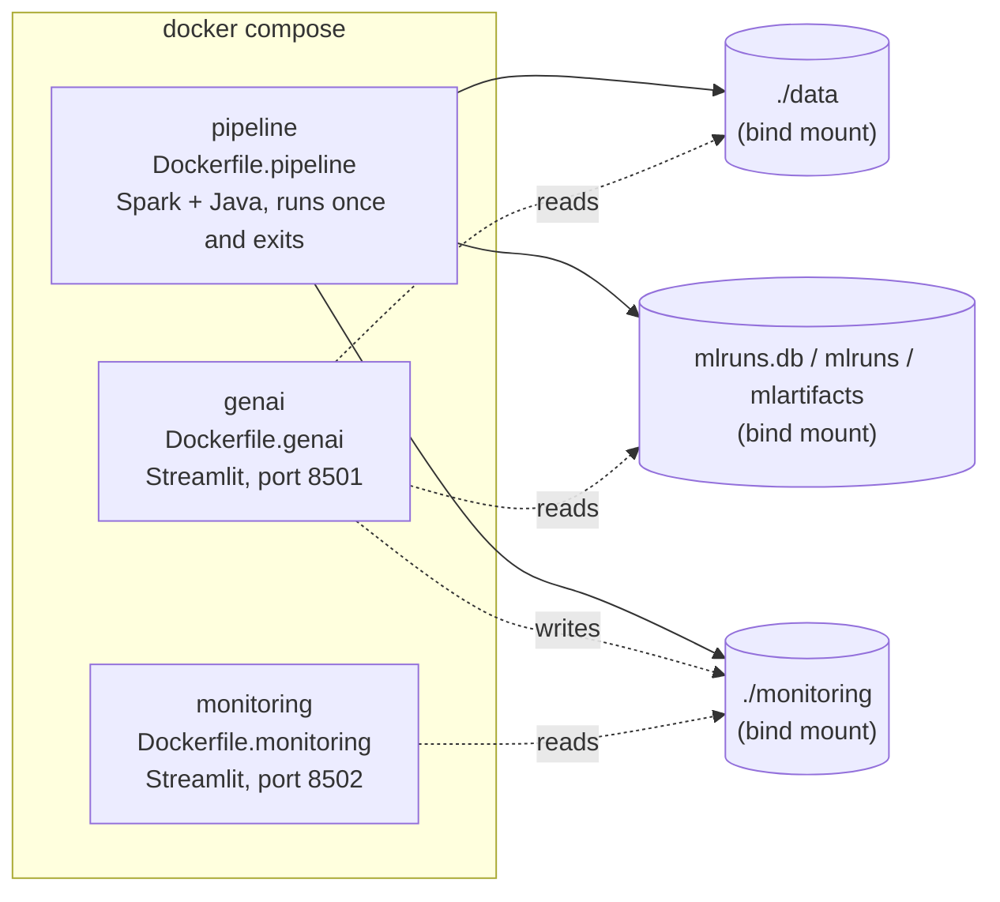

# Architecture

```mermaid
flowchart TD
    RAW[("Raw CSVs\ntransactions.csv / customers.csv")]

    subgraph Ingestion & Data Engineering
        BRONZE["Bronze\nschema-enforced, lineage metadata"]
        DQ{"Data Quality Gate\nblocks pipeline if score < threshold"}
        SILVER["Silver\ncleaning, dedup, quarantine table"]
        GOLD["Gold\ncategory_sales / customer_features"]
    end

    subgraph ML Lifecycle
        TRAIN["Train churn model\n(Random Forest)"]
        MLFLOW[("MLflow\ntracking + model registry")]
        PROMOTE{"Promotion Gate\npromote only if new AUC beats Production"}
        MODELGATE{"Model Evaluation Gate\nblocks pipeline if Production AUC < threshold"}
    end

    subgraph GenAI Layer -- no API key
        ROUTER["Router"]
        SQL["Text-to-SQL\nDuckDB over Gold tables"]
        EXPLAIN["Churn Explainer\nProduction model + reference profiles"]
        UI["Streamlit Chat UI"]
    end

    subgraph Observability
        MON[("monitoring/metrics_history.jsonl\nmonitoring/query_log.jsonl")]
        DASH["Monitoring Dashboard\nDQ trend, model AUC trend, query activity"]
    end

    RAW --> BRONZE --> DQ
    DQ -- pass --> SILVER --> GOLD
    DQ -- fail --> HALT1(["Pipeline halted\nrun still logged to monitoring"])

    GOLD --> TRAIN --> MLFLOW --> PROMOTE
    PROMOTE --> MODELGATE
    MODELGATE -- fail --> HALT2(["Pipeline halted\nrun still logged to monitoring"])

    GOLD --> SQL
    MLFLOW --> EXPLAIN
    ROUTER --> SQL
    ROUTER --> EXPLAIN
    UI --> ROUTER

    DQ -.-> MON
    MODELGATE -.-> MON
    ROUTER -.-> MON
    MON --> DASH

    style DQ fill:#fff3cd,stroke:#856404
    style MODELGATE fill:#fff3cd,stroke:#856404
    style PROMOTE fill:#fff3cd,stroke:#856404
    style HALT1 fill:#f8d7da,stroke:#721c24
    style HALT2 fill:#f8d7da,stroke:#721c24
```

## Deployment view (Docker)



Three purpose-split images rather than one "do everything" image: `pipeline`
needs the JVM (PySpark), `genai` and `monitoring` deliberately don't (DuckDB
+ pandas + Streamlit only) -- see `docs/deployment.md` for why, and for the
one gotcha (touch `mlruns.db` before first run) that trips people up.

## Why two gates, not one

The **Data Quality Gate** and **Model Evaluation Gate** are independent and
serial: bad data never reaches training (the DQ gate blocks it before
Silver/Gold even run), and a bad model never reaches Production even if it
somehow got trained (the promotion gate only flips the alias if it's
actually better; the CI gate independently re-checks the current Production
model on every run, so a bug in the promotion logic isn't the only thing
protecting Production). Both failure paths still get logged to monitoring
-- see `docs/incident_postmortem.md` and `docs/model_incident_postmortem.md`
for real, reproducible runs of each.
